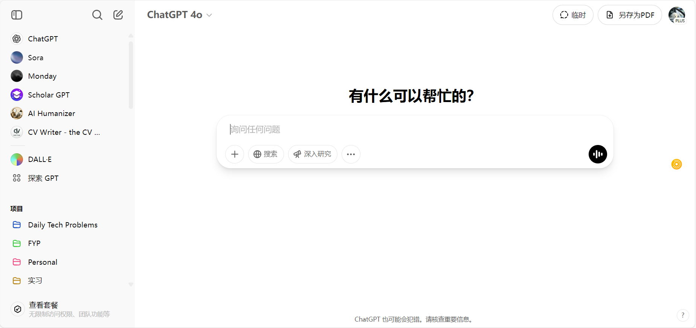

# ChatGPT-to-PDF

🌐 English | [中文](./README-zh.md)

A Tampermonkey userscript that inserts a **Save as PDF** button into ChatGPT UI, redirecting copied messages to [paste2pdf.net](https://paste2pdf.net) for instant PDF conversion.

## ✅ Features

- 🧠 Seamlessly integrated with ChatGPT top bar UI
- 🖼 Opens paste2pdf.net in a **popup window**
- 🔁 Button auto-restores itself after UI re-render (MutationObserver based)
- ⚡ Automatically clicks the red "1-Click PDF" button

## 📦 Installation

1. Install [Tampermonkey](https://www.tampermonkey.net/)
2. Click to install [latest version](https://raw.githubusercontent.com/SeanX16/ChatGPT-to-PDF/main/ChatGPT-to-PDF-button-latest.user.js)
3. Or pick from historical versions below:

| Version | Script | Description |
|---------|--------|-------------|
| v1.2 🆕 | [ChatGPT-to-PDF-button-v1.2.user.js](https://raw.githubusercontent.com/SeanX16/ChatGPT-to-PDF/main/versions/ChatGPT-to-PDF-button-v1.2.user.js) | Improved positioning logic: inserts before new "Show Details"/"Conversation Options" button if present, otherwise before "Profile"; avoids duplication in sidebar |
| v1.1 | [ChatGPT-to-PDF-button-v1.1.user.js](https://raw.githubusercontent.com/SeanX16/ChatGPT-to-PDF/main/versions/ChatGPT-to-PDF-button-v1.1.user.js) | Opens paste2pdf.net in a popup and auto-clicks red button (#one-click-btn) instantly |
| v1.0 | [ChatGPT-to-PDF-button-v1.0.user.js](https://raw.githubusercontent.com/SeanX16/ChatGPT-to-PDF/main/versions/ChatGPT-to-PDF-button-v1.0.user.js) | Opens paste2pdf.net in a popup and clicks red button after delay (setTimeout) |
| v0.4 | [ChatGPT-to-PDF-button-v0.4.user.js](https://raw.githubusercontent.com/SeanX16/ChatGPT-to-PDF/main/versions/ChatGPT-to-PDF-button-v0.4.user.js) | MutationObserver-based, re-inserts button without polling |
| v0.3 | [ChatGPT-to-PDF-button-v0.3.user.js](https://raw.githubusercontent.com/SeanX16/ChatGPT-to-PDF/main/versions/ChatGPT-to-PDF-button-v0.3.user.js) | Polling-based, checks DOM every second and re-inserts button |

## 🛠 Usage

1. In ChatGPT, click the "Copy" button on any message you want to save.
2. Click "Save as PDF" in the top-right bar.
3. A popup will open [paste2pdf.net](https://paste2pdf.net), which previews content and auto-triggers PDF rendering.

> 💡 Recommended to use Microsoft Edge for the cleanest PDF output.

## 🖼 Screenshot

